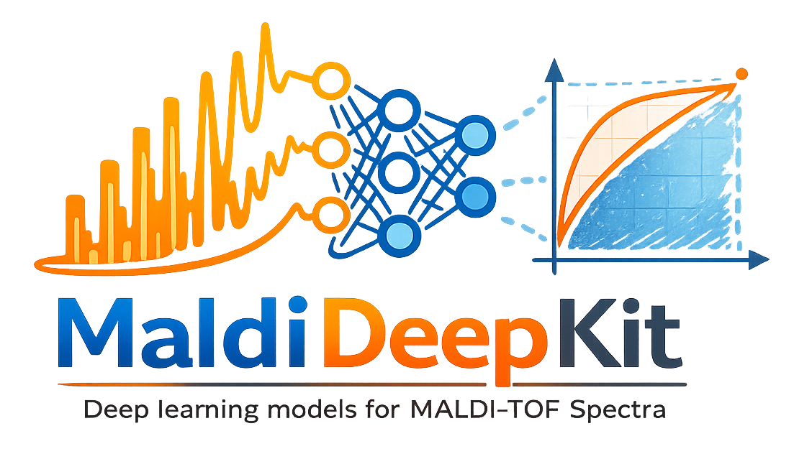

# MaldiDeepKit

[](https://github.com/EttoreRocchi/MaldiDeepKit/actions/workflows/ci.yml)
[](https://codecov.io/github/EttoreRocchi/MaldiDeepKit)
[](https://maldideepkit.readthedocs.io/)

[](https://pypi.org/project/maldideepkit/)
[](https://pypi.org/project/maldideepkit/)
[](https://github.com/EttoreRocchi/MaldiDeepKit/blob/main/LICENSE)

<p align="center">
  
</p>

<p align="center">
  <strong>A catalog of sklearn-compatible deep learning classifiers for MALDI-TOF binned spectra</strong>
</p>

<p align="center">
  <a href="#installation">Installation</a> •
  <a href="#features">Features</a> •
  <a href="#quick-start">Quick Start</a> •
  <a href="https://maldideepkit.readthedocs.io/">Documentation</a> •
  <a href="#tutorials">Tutorials</a> •
  <a href="#maldisuite-ecosystem">MaldiSuite</a> •
  <a href="#contributing">Contributing</a> •
  <a href="#citing">Citing</a> •
  <a href="#license">License</a>
</p>

MaldiDeepKit is part of the **MaldiSuite** ecosystem and complements [MaldiAMRKit](https://github.com/EttoreRocchi/MaldiAMRKit) and [MaldiBatchKit](https://github.com/EttoreRocchi/MaldiBatchKit): where MaldiAMRKit handles preprocessing, alignment and AMR-aware evaluation, and MaldiBatchKit harmonises multi-centre spectra, MaldiDeepKit focuses on the *classification* step, providing four PyTorch architectures wrapped in a unified scikit-learn estimator API with defaults calibrated for 6000-bin MALDI-TOF input.

## Installation

```bash
pip install maldideepkit
```

`maldiamrkit` is a core dependency and is installed automatically - MaldiDeepKit duck-types on the `MaldiSet` data model and reuses `maldiamrkit.alignment.Warping` for leak-safe spectral warping.

To enable the Laplace-approximation estimator in `maldideepkit.uncertainty`, install the optional `uncertainty` extra (pulls in [`laplace-torch`](https://github.com/aleximmer/Laplace)):

```bash
pip install "maldideepkit[uncertainty]"
```

Monte Carlo Dropout and split conformal prediction work without any extra.

### Install the full MaldiSuite

To install MaldiDeepKit together with [MaldiAMRKit](https://github.com/EttoreRocchi/MaldiAMRKit) and [MaldiBatchKit](https://github.com/EttoreRocchi/MaldiBatchKit) at compatible versions, install the [`maldisuite`](https://pypi.org/project/maldisuite/) meta-package:

```bash
pip install maldisuite
```

Visit the **MaldiSuite** landing page at <https://ettorerocchi.github.io/MaldiSuite/>.

### Development Installation

```bash
git clone https://github.com/EttoreRocchi/MaldiDeepKit.git
cd MaldiDeepKit
pip install -e ".[dev]"
pre-commit install
```

See [`CONTRIBUTING.md`](CONTRIBUTING.md) for coding conventions, testing, and PR guidelines.

## Features

- **Unified sklearn API** (`BaseEstimator` + `ClassifierMixin`) for every classifier. Each one implements `fit` / `predict` / `predict_proba` / `score` / `get_params` / `set_params` and plugs into `Pipeline`, `cross_val_score`, and `GridSearchCV` with no glue code.
- **Four PyTorch architectures** sharing the same base class and hyperparameter surface:
  - `MaldiMLPClassifier` - MLP with optional sigmoid-gated attention, interpretable per-bin gates.
  - `MaldiCNNClassifier` - 1-D Conv1D + BatchNorm + ReLU + MaxPool blocks for local pattern learning.
  - `MaldiResNetClassifier` - 1-D ResNet-18-style residual blocks for a deeper convolutional backbone.
  - `MaldiTransformerClassifier` - 1-D Vision Transformer with global self-attention, pre-norm, LayerScale, and stochastic depth.
- **MALDI-TOF defaults**: kernel sizes, depths, patch widths, and warmup / cosine-annealing schedules are tuned for 6000-bin spectra in the 2000-20000 Da range.
- **Auto-scaling for non-default layouts**: every classifier ships a `from_spectrum(bin_width, input_dim, **overrides)` factory that rescales conv kernels and patches when the user trims the m/z range or picks a different bin width. See the [Spectrum scaling guide](https://maldideepkit.readthedocs.io/en/latest/spectrum_scaling.html).
- **Training recipes**: AdamW-on-`weight_decay` dispatch, gradient clipping, linear warmup + cosine annealing, focal loss, label smoothing, mixed precision (AMP), Stochastic Weight Averaging, Sharpness-Aware Minimization, post-hoc threshold tuning, and temperature scaling - all exposed as classifier kwargs.
- **Leak-safe spectral warping**: pass any sklearn-style transformer ([`maldiamrkit.alignment.Warping`](https://github.com/EttoreRocchi/MaldiAMRKit)) via `warping=`; it is fitted on the training fold only and applied to both splits during training and to new spectra at `predict` time, *before* per-feature standardization.
- **MaldiSet integration**: pass a `maldiamrkit.MaldiSet` directly to `fit` / `predict`; MaldiDeepKit duck-types on the DataFrame-like `.X` attribute, so MaldiSuite's data model flows end-to-end.
- **Persistence**: `save()` writes a state-dict `.pt` plus a hyperparameter `.json` (and a sibling `.warper.pkl` if a warper was fitted); `load()` fails fast on class or `input_dim` mismatches.
- **Uncertainty quantification**: `maldideepkit.uncertainty` subpackage ships three drop-in estimators sharing a single `predict_with_uncertainty` interface. `MCDropoutEstimator` (Monte Carlo Dropout with epistemic / aleatoric decomposition), `LaplaceEstimator` (last-layer or full-network Laplace via the optional `laplace-torch` dependency), and `ConformalPredictor` (split conformal prediction with the LAC non-conformity score).
- **CPU-friendly**: every classifier runs on CPU, which is what the project's CI tests against; CUDA speeds up the models' training significantly.

## Documentation

Full documentation is available at [maldideepkit.readthedocs.io](https://maldideepkit.readthedocs.io/).

## Quick Start

### Fit a Classifier

Every MaldiDeepKit classifier exposes the standard scikit-learn estimator API. Swapping architectures is a one-line change:

```python
import numpy as np
from maldideepkit import MaldiMLPClassifier

rng = np.random.default_rng(0)
X = rng.standard_normal((200, 6000)).astype("float32")  # 200 binned spectra
y = rng.integers(0, 2, size=200)

clf = MaldiMLPClassifier(random_state=0)
clf.fit(X, y)

proba = clf.predict_proba(X)
preds = clf.predict(X)
acc = clf.score(X, y)

# Inspect attention weights (MLP only)
weights = clf.get_attention_weights(X[:10])  # (10, hidden_dim)
```

### Inside a scikit-learn `Pipeline`

```python
from sklearn.model_selection import StratifiedKFold, cross_val_score
from sklearn.pipeline import Pipeline
from sklearn.preprocessing import StandardScaler
from maldideepkit import MaldiCNNClassifier

pipe = Pipeline([
    ("scaler", StandardScaler()),
    ("clf", MaldiCNNClassifier(random_state=0)),
])

cv = StratifiedKFold(n_splits=5, shuffle=True, random_state=0)
scores = cross_val_score(pipe, X, y, cv=cv, scoring="accuracy")
print(f"CV accuracy: {scores.mean():.3f} +/- {scores.std():.3f}")
```

### MaldiSet Integration

Integration with [MaldiAMRKit](https://github.com/EttoreRocchi/MaldiAMRKit) is first-class: pass a `MaldiSet` directly.

```python
from maldiamrkit import MaldiSet
from maldideepkit import MaldiCNNClassifier

ds = MaldiSet.from_directory(
    "spectra/", "metadata.csv",
    aggregate_by={"antibiotics": "Ciprofloxacin"},
    n_jobs=-1,
)
clf = MaldiCNNClassifier(random_state=0).fit(ds, ds.y.squeeze())
preds = clf.predict(ds)
```

### Auto-Scaling for Custom Layouts

When the spectrum layout deviates from the reference 6000-bin / 3 Da default, `from_spectrum` rescales conv kernels and patches:

```python
from maldideepkit import MaldiCNNClassifier, MaldiTransformerClassifier

# Reference layout (kernel_size=7, patch_size=4)
cnn = MaldiCNNClassifier.from_spectrum(bin_width=3, input_dim=6000)

# Wider bins -> smaller kernel
cnn_coarse = MaldiCNNClassifier.from_spectrum(bin_width=6, input_dim=3000)

# Transformer is scale-agnostic; only input_dim is recorded
tr = MaldiTransformerClassifier.from_spectrum(bin_width=1, input_dim=18000)
```

See the [Spectrum scaling guide](https://maldideepkit.readthedocs.io/en/latest/spectrum_scaling.html) for the semantics behind each knob.

### Save and Load

```python
clf.save("my_model")
# -> my_model.pt, my_model.json, my_model.warper.pkl (if warping was used)
restored = MaldiCNNClassifier.load("my_model")
```

For more examples covering training recipes, calibration, attention inspection, and ensembles, see the [Quickstart Guide](https://maldideepkit.readthedocs.io/en/latest/quickstart.html) and the [API Reference](https://maldideepkit.readthedocs.io/en/latest/api/index.html).

## Algorithms

| Classifier                     | Backbone                                               | Typical use case                                       |
|--------------------------------|--------------------------------------------------------|--------------------------------------------------------|
| `MaldiMLPClassifier`           | MLP + optional sigmoid-gated attention                 | Fast baseline with interpretable feature gates         |
| `MaldiCNNClassifier`           | 1-D Conv1D + BatchNorm + ReLU + MaxPool blocks         | Local pattern learning from binned spectra             |
| `MaldiResNetClassifier`        | 1-D ResNet-18-style residual blocks                    | Deeper convolutional backbone                          |
| `MaldiTransformerClassifier`   | 1-D Vision Transformer (LayerScale, stochastic depth)  | Long-range peak combinations via global self-attention |

All four inherit from `BaseSpectralClassifier` and share the same hyperparameter surface for optimisation, device placement, early stopping, calibration, and persistence.

### Shared Training Knobs

| Feature                            | Kwarg                          | Notes                                                                               |
|------------------------------------|--------------------------------|-------------------------------------------------------------------------------------|
| Decoupled weight decay             | `weight_decay`                 | Switches Adam to AdamW when `> 0`. Default `0` (MLP/CNN), `1e-4` (ResNet), `0.05` (Transformer). |
| Gradient clipping                  | `grad_clip_norm`               | `clip_grad_norm_` before every step. Default on (`1.0`) for the deep models.        |
| Warmup + cosine annealing          | `warmup_epochs`                | Replaces plateau scheduler. Default `5` (deep models), `0` (MLP/CNN).               |
| Stochastic depth (Transformer)     | `drop_path_rate`               | Linearly ramped across blocks. Default `0.1`.                                       |
| LayerScale (Transformer)           | `layerscale_init`              | Per-channel residual scaling initialised near zero - crucial on small cohorts.      |
| Focal loss                         | `loss="focal"` + `focal_gamma` | For imbalanced binary problems.                                                     |
| Label smoothing                    | `label_smoothing`              | Passed to both cross-entropy and focal paths.                                       |
| Stochastic Weight Averaging        | `swa_start_epoch`              | `AveragedModel` replaces best-val at end of fit.                                    |
| Threshold tuning                   | `tune_threshold`               | Binary only; sweeps balanced-accuracy / F1 / Youden on val.                         |
| Temperature scaling                | `calibrate_temperature`        | One-parameter LBFGS calibration on val logits.                                      |
| Sharpness-Aware Minimization       | `use_sam` + `sam_rho`          | Two-pass training, ~2× compute.                                                     |
| Spectral warping                   | `warping`                      | Any `Warping`-like sklearn transformer; fitted on train only, applied before standardization.      |

### Utilities

`maldideepkit.utils` exposes:

- **`find_lr(clf, X, y)`** - learning-rate finder.
- **`tune_threshold` / `fit_temperature`** - post-hoc calibrators usable standalone.
- **`FocalLoss`, `SAMOptimizer`** - loss / optimizer building blocks for custom training loops. Composable `nn.Module` primitives (`DropPath`, `PatchEmbed1D`, the full backbones) live under `maldideepkit.blocks`.

## Tutorials

For more detailed examples, see the notebooks:

- [Quick Start](notebooks/01_quick_start.ipynb) - Fit a `MaldiMLPClassifier` and explore the sklearn-compatible API.
- [Model Comparison](notebooks/02_model_comparison.ipynb) - Train all four classifiers on the same dataset and compare accuracy.
- [Attention Interpretation](notebooks/03_attention_interpretation.ipynb) - Visualise the sigmoid-gated attention learned by `MaldiMLPClassifier`.
- [Full Pipeline](notebooks/04_full_pipeline.ipynb) - End-to-end template: MaldiAMRKit preprocessing + MaldiDeepKit classification.
- [Uncertainty Quantification](notebooks/05_uncertainty.ipynb) - MC Dropout, split conformal prediction, and Laplace approximation on a fitted classifier; selective prediction curves.

## MaldiSuite Ecosystem

MaldiDeepKit is the deep-learning package of the **MaldiSuite** ecosystem:

- **[MaldiAMRKit](https://github.com/EttoreRocchi/MaldiAMRKit)** - preprocessing, alignment, peak detection, differential analysis, and classical-ML evaluation for MALDI-TOF AMR workflows.
- **[MaldiBatchKit](https://github.com/EttoreRocchi/MaldiBatchKit)** - batch-effect correction and harmonisation for multi-centre / multi-instrument MALDI-TOF spectra.
- **MaldiDeepKit** (this package) - sklearn-compatible deep learning classifiers.

The three packages share the `MaldiSet` / `MaldiSpectrum` data model and are designed to compose in a single end-to-end pipeline. Install the full suite with `pip install maldisuite`. Landing page: [MaldiSuite](<https://ettorerocchi.github.io/MaldiSuite/>).

## Requirements

The models benefit significantly from CUDA; CPU fallback is supported for all models.

## Contributing

Pull requests, bug reports, and feature ideas are welcome. See the [Contributing Guide](CONTRIBUTING.md) for how to get started.

## Citing

If you use MaldiDeepKit in academic work please cite:

> _Citation will be available soon._

See the [full publications list](https://maldideepkit.readthedocs.io/en/latest/papers.html) for more papers using the MaldiSuite.

## License

This project is licensed under the **MIT License**. See the [LICENSE](LICENSE) file for details.

## Acknowledgements

The architectures and training recipes bundled in MaldiDeepKit are 1-D adaptations of well-established networks. In particular:

> **ResNet** - He K, Zhang X, Ren S, Sun J (2016). *Deep Residual Learning for Image Recognition*. **CVPR**. [doi:10.1109/CVPR.2016.90](https://doi.org/10.1109/CVPR.2016.90)

> **Vision Transformer** - Dosovitskiy A, Beyer L, Kolesnikov A, *et al.* (2021). *An Image is Worth 16x16 Words: Transformers for Image Recognition at Scale*. **ICLR**. [arXiv:2010.11929](https://arxiv.org/abs/2010.11929)

> **LayerScale** - Touvron H, Cord M, Sablayrolles A, *et al.* (2021). *Going deeper with Image Transformers*. **ICCV**. [arXiv:2103.17239](https://arxiv.org/abs/2103.17239)

> **Stochastic Depth** - Huang G, Sun Y, Liu Z, Sedra D, Weinberger K (2016). *Deep Networks with Stochastic Depth*. **ECCV**. [arXiv:1603.09382](https://arxiv.org/abs/1603.09382)

> **Temperature Scaling** - Guo C, Pleiss G, Sun Y, Weinberger KQ (2017). *On Calibration of Modern Neural Networks*. **ICML**. [arXiv:1706.04599](https://arxiv.org/abs/1706.04599)

> **Sharpness-Aware Minimization** - Foret P, Kleiner A, Mobahi H, Neyshabur B (2021). *Sharpness-Aware Minimization for Efficiently Improving Generalization*. **ICLR**. [arXiv:2010.01412](https://arxiv.org/abs/2010.01412)
